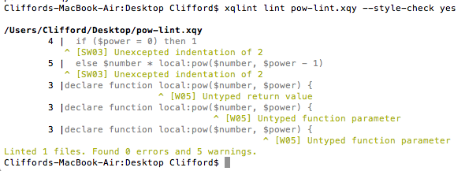

#Handling & Preventing Errors

Learning how to diagnose, interpret, and prevent errors constitutes a major part of learning to program in any language. What follows is a whirlwind tour of errors in XQuery as well as some tools to prevent them from cropping up in the first place.

##Three Kinds of Error

There are essentially three kinds of error in XQuery: static errors, dynamic errors, and type errors. The [XQuery Recommendation](http://www.w3.org/TR/2014/REC-xquery-30-20140408/#id-kinds-of-errors) defines and discusses the differences between these errors.

###Static Errors

>[Definition: An error that can be detected during the static analysis phase, and is not a type error, is a static error.] A syntax error is an example of a static error.

Static errors are the most common form of mistakes, especially when you are beginning to program. If you make a syntax mistake, such as using ```=``` for assignment rather than ```:=``` or forgetting to include a matching parenthesis/bracket, you have committed a static error. This is a static error because an XQuery interpreter will catch it before your program even runs (technically, it gets caught during the static analysis phase).  

###Dynamic Errors

>[Definition: A dynamic error is an error that must be detected during the dynamic evaluation phase and may be detected during the static analysis phase.] Numeric overflow is an example of a dynamic error.

A dynamic error, by contrast, may not be caught before your program runs. You may have gotten the syntax right but still have gone awry with your program logic. For example, you may have written a recursive function that does not specify properly a base case. If so, the function will continue to call itself until it runs out of space on the stack, resulting in a [stack overflow](http://en.wikipedia.org/wiki/Stack_overflow). This error may not be detectable until the program executes (technically, during the dynamic evaluation phase). This is the kind of "bug" that crashes your program after it begins running. In general, these kinds of "bugs" are harder to diagnose and resolve.

###Type Errors

>[Definition: A type error may be raised during the static analysis phase or the dynamic evaluation phase. During the static analysis phase, a type error occurs when the static type of an expression does not match the expected type of the context in which the expression occurs. During the dynamic evaluation phase, a type error occurs when the dynamic type of a value does not match the expected type of the context in which the value occurs.]

A common source of errors arises from type mismatches. We've already seen how to write functions that check the types of their inputs and outputs. Sending an argument of the wrong type to a function results in type error. A good example of this mistake is when your code produces a "number" that is actually a xs:string and you send that "number" to a function requiring an xs:integer as input. In order to avoid such an error, you will first need to cast the string to an integer.

For example, this expression checks if a variable can be cast as an xs:integer and, if not, throws an error.

```xquery
let $num := "1"
let $int := if ($num castable as xs:integer) then xs:integer($num) else fn:error()
return $int
```

[Try it!](http://try.zorba.io/queries/xquery/meFXr1HHu%2BGBe7O3l1aj40GxStk%3D)

This style of defensive programming helps to surface type mismatches which might otherwise produce hard-to-diagnose bugs in your code.

##Reading Errors

Reading error messages takes a little practice. When you encounter an error, you will receive what many perceive as a cryptic message identifying the kind of error along with an indication of where that error occurred in your code.

For example, evaluating this expression

```xquery
xquery version "3.0";

3 * "2"
```

produces the following error

```
[XPTY0004] arithmetic operation not defined between types "xs:integer" and "xs:string"

Line 3, column 1.
```

[Try it!](http://try.zorba.io/queries/xquery/FOo3dt8sY4W01pSaqW6HcWo545A%3D)

Let's see if we can understand what the interpreter is telling us about what went wrong.

First, notice the code inside the square brackets. The code identifies the error according to the following formula from the [XQuery recommendation](http://www.w3.org/TR/2014/REC-xquery-30-20140408/#id-identifying-errors):

>* [XXYYnnnn]
>* XX denotes the language in which the error is defined, using the following encoding:
	* XP denotes an error defined by XPath. Such an error may also occur in XQuery since XQuery includes XPath as a subset.
	* XQ denotes an error defined by XQuery (or an error originally defined by XQuery and later added to XPath).
> * YY denotes the error category, using the following encoding:
	* ST denotes a static error.
	* DY denotes a dynamic error.
	* TY denotes a type error.
* nnnn is a unique numeric code.

*N.B. You will also see FO (functions and operators) and SE (serialization errors) as two digit language codes*

Using this information, we can decode some of the error identifier. The first two characters ```XP``` indicate that we have incurred an error in XPath. The second two characters ```TY``` tell us that we have caused a type error. But what about our four digit code ````0004````?

Here we need to read another W3C Document called the [XQuery and XPath Functions and Operators Error Codes Namespace Document](http://www.w3.org/2005/xqt-errors/). If we go to that document, we can look up the identifier of our error. It turns out that [XPTY0004](http://www.w3.org/TR/xpath-30/#ERRXPTY0004) is a pretty generic type mismatch error. 

The implementation tells us a little more about why this error occurred. We see that we cannot add an xs:integer and an xs:string together. 

The implementation also provides a line and column number for the error. This may not always accurately reflect where the error needs to be remedied. For example, in this case, the implementation identifies ```Line 3, column 1``` as the source of the problem. This is, of course, the xs:integer we tried to add to an xs:string. To fix this problem, we'd probably want to change the xs:string in column 6 to an xs:integer.

##Defensive Programming

A leading idea of [defensive programming](http://en.wikipedia.org/wiki/Defensive_programming) is to make as few implicit assumptions about your code and data as practically possible. For instance, it is better not to assume that the input to a function will always have the expected type. Rather, try to make your assumptions explicit by checking the types of your function arguments and return values. Also, write code to test for and handle common error conditions.

Compare the difference between

```xquery
xquery version "3.0";

declare function local:divide($num1, $num2)
{
  $num1 div $num2
};

local:divide(2,"a")
```

and

```xquery
xquery version "3.0";

declare function local:divide($num1 as xs:double, $num2 as xs:double) as xs:double
{
  if ($num2 != 0) then $num1 div $num2
  else fn:error(xs:QName("FOAR0001"), "Hey, you're trying to divide by zero!")
};

local:divide(2,"a")
```

[Try it!](http://try.zorba.io/queries/xquery/fCwpDjLwAaQgxal0auMkoeDR4tY%3D)

In the first example, we do not check the type of our arguments and thus allow problematic arguments (like xs:string types) to be passed into our function. We also do not check for common error conditions such as division by zero. The second example handles error conditions more robustly by guarding against inappropriate function arguments and gracefully handling division by zero errors.

##Try/Catch Expressions

XQuery 3.0 introduces a [try/catch expression](http://www.w3.org/TR/xquery-30/#id-try-catch) to assist with handling errors. A try/catch expression can be used to intercept dynamic errors and type errors that might otherwise bring your program to a sudden halt.

*N.B. Try/Catch expressions do not handle static errors, which get identified prior to the dynamic evaluation phase.*

Here's an example of how a try/catch expression works in practice:

```xquery
xquery version "3.0";

try {
    3 * "2"
}
catch * {
    "Something went wrong!"
}
```

[Try it!](http://try.zorba.io/queries/xquery/6ekWWgACzClLrdXCf5gyv%2FBiirs%3D)

The ```*``` after the catch keyword indicates that we'd like to catch all errors. We could specify the kind(s) of error(s) by substituting a corresponding error identifier(s) for ```*```. We might do this if we want to catch some errors, but leave others unhandled. For example,

```xquery
xquery version "3.0";

try {
    3 div 0 
}
catch XPTY0004 {
    "Something went wrong!"
}
```

This try/catch expression only handles type errors. If we attempt to divide 3 by zero, we'll get a ```[FOAR0001] division by zero``` error, which won't be caught and will halt our program.

Deciding when to use try/catch expressions can be tricky. Obviously, try/catch expressions can be useful when you don't want your program to crash in the event of an error. For example, you might include a try/catch expression in your controller when writing a web application to handle unexpected errors in a graceful way rather than displaying cryptic error messages to your user. On the other hand, try/catch expressions can themselves become sources of "bugs," especially if you handle errors in logic which should have been fixed prior to the execution of your program.

The art of using try/catch expressions is [much debated](http://programmers.stackexchange.com/questions/64180/good-use-of-try-catch-blocks). A good rule of thumb is to use try/catch expressions when dealing with an external environment. For example, if you write an expression that takes a string as an argument and opens a file on the file system with a filename corresponding to that string, you should probably enclose it in a try/catch expression to handle potential I/O errors gracefully.

##XQSuite

XQuery 3.0 introduced the concept of [annotations](http://www.w3.org/TR/2014/REC-xquery-30-20140408/#id-annotations) to the language. Annotations offer a mechanism for associating metadata with functions. For example, an annotation might indicate that a function is private – i.e., cannot be called from a function external to its module. Annotations provide an adaptable means to implement functionality orthogonal to functions.

[XQSuite](http://exist-db.org/exist/apps/doc/xqsuite.xml) provides the ability to conduct unit tests within XQuery.

```xquery
xquery version "3.0";

(: imports the test module :)
import module namespace test="http://exist-db.org/xquery/xqsuite" at "resource:org/exist/xquery/lib/xqsuite/xqsuite.xql";

(: annotations come between the declare keyword and the function keyword :)
declare
    %test:name("cube")
    %test:args(2, 3)
    %test:assertEquals(8)
    function local:pow($number as xs:integer, $power as xs:integer) as xs:integer {
        if ($power = 0) then 1
        else $number * local:pow($number, $power - 1)
};

(: pass the function name & arity (i.e. number of arguments) into the test:suite function :)
test:suite(local:pow#2)
```

The annotations describing the test are located between the ```declare``` keyword and the ```function``` keyword. The ```%``` symbol indicates that the line is an annotation. In this case, we use three annotations to name the test, provide representative arguments, and then assert the value of the function. We call this test by passing the name of the function along with its arity (i.e., the number of arguments) to the ```test:suite``` function.

The result looks like this:
```xquery
<testsuites>
	<testsuite package="http://www.w3.org/2005/xquery-local-functions" timestamp="2014-06-03T13:10:39.603-05:00"  failures="0"  tests="1"  time="PT0.004S">
		<testcase name="cube"  class="local:pow"/>
	</testsuite>
</testsuites>
```

For more on XQSuite, see the [XUnit Annotations](http://en.wikibooks.org/wiki/XQuery/XUnit_Annotations) chapter in the [XQuery WikiBook](http://en.wikibooks.org/wiki/XQuery).

##XQLint

Many programming languages offer a tool for uncovering static errors called "lint." (The name is not an acronym; apparently, it derives from the ["undesirable bits of fiber and fluff found in sheep's wool"](http://en.wikipedia.org/wiki/Lint_(software)#Background).)

[William Candillon](https://github.com/wcandillon) has recently released a lint tool for XQuery called [XQLint](https://github.com/wcandillon/xqlint). The tool not only performs static analysis of XQuery code; it can also check for conformity to style guidelines.

To use the tool, you must have [Node.js](http://nodejs.org/) installed on your machine. We won't install Node in this session because the setup time would be too long. However, I'll demonstrate the functionality for you with some sample code.

To run XQLint (on a Mac), open up a bash shell and type ```xqlint lint [NAME_OF_FILE] --style-check yes```. The ```--style-check yes``` flag means that XQLint will not only conduct a static analysis to find errors in your code but also warn you about stylistic problems.

Let's see the result of running XQLint over this code snippet:
```xquery
xquery version "1.0";

declare function local:pow($number, $power) {
  if ($power = 0) then 1
  else $number * local:pow($number, $power - 1)
};

local:pow(2,3)
```

Here are the results from XQLint:



XQLint indicates that I've committed two faux-pas in my code. The first two warnings note that I indented my function body with two spaces rather than a single tab. Obviously, this is a stylistic warning. The last three warnings note that I failed to provide types for my function parameters and return value. As we've noted above, it's not an error to omit type checking when writing functions but it potentially opens the door to type errors. XQLint warns against leaving the types implicit to head off such errors.

##XQDoc

[XQDoc](http://xqdoc.org/) creates XQuery documentation from comments in your source file. While documentation is not strictly speaking a matter of error handling, good documentation can frequently prevent inadvertent errors. Good documentation also promotes code reuse. By commenting your code well and by producing readable documentation, you may be able to help others avoid making mistakes when using your code.

Let's consider an example of undocumented code:

```xquery
xquery version "1.0";

declare function local:pow($number as xs:integer, $power as xs:integer) as xs:integer {
  if ($power = 0) then 1
  else $number * local:pow($number, $power - 1)
};

local:pow(2,3)
```

To understand this function, we need to read through the code. Of course, it is easy enough to read through this small function. But things get complicated with larger functions and modules.

We're also missing information about its author. We don't know that this function was adapted from an example provided by Michael Kay on [Stackoverflow](http://stackoverflow.com/a/15369640).

Let's look at the same example with XQDoc comments:

```xquery
xquery version "3.0";
 
(:~ The purpose of this main module is to demonstrate the use of a recursive function.
:   @author Clifford Anderson
:   @version 1.0
:)
 
(:~ This function raises a given integer by a given power. 
:   @author Clifford Anderson
    @version 1.0
    @see http://stackoverflow.com/a/15369640;;Adapted from Michael Kay's example on Stackoverflow.
    @param $number An integer to be raised by a power
    @param $power An integer indicating the power to be raised
    @return An integer
:)
declare function local:pow($number as xs:integer, $power as xs:integer) as xs:integer {
  if ($power = 0) then 1
  else $number * local:pow($number, $power - 1)
};
 
local:pow(2,3)
```

Note the additional tilde at the opening of an XQuery comment: ```(:~```. This indicates that the comment block should be processed by XQDoc. XQDoc provides a number of metadata attributes to capture information: ```@author``` for the author(s); ```@version``` for the version number; ```@see``` for cross references; ```@param``` for description of the function arguments;  and ```@return``` for description of the return value, among others.

Applying XQDoc to this module produces a nicely-formatted documentation page in [HTML](http://htmlpreview.github.io/?https://raw.githubusercontent.com/XQueryInstitute/Course-Materials/master/error%20handling/pow.xquery.html).

##Conclusion

We now understand how to interpret XQuery error codes, to throw errors, and to catch errors gracefully. We've also seen a range of tools that can help to prevent errors such as XQSuite, XQDoc, and XQLint. In the end, avoiding and diagnosing errors is as much an art as a science. You'll inevitably make many mistakes when you begin coding in any language. Tracking down the sources of your errors generally turns you into a better programmer over time. The tools can aid you in this process but you'll also develop your own "intuition" – experienced programmers claim to detect "code smells" – about where things may have gone wrong in your code and why.


